# Paperless‑ngx AI 增强版

基于 `paperless-ngx` 的二次开发项目，聚焦于将文档管理与 AI 能力深度融合，帮助你以低成本构建本地私有的高效知识库与文档工作流。

## 项目概览

- 核心基座：成熟稳定的 `paperless-ngx` 文档管理系统（OCR、检索、权限、多格式处理）
- 增强能力：引入大语言模型（LLM）与视觉语言模型（VLM），实现更强的内容理解与交互体验
- 部署形态：Docker Compose 一键部署，默认同时启动 MariaDB、Redis、Apache Tika、Gotenberg
- 端口说明：默认通过 `http://<主机IP>:8008/` 访问（容器内部监听 `8000` → 外部映射 `8008`）

## 基础特性

- 智能组织与索引：标签、通信方、文档类型、存储路径，支持批量编辑与自动建议
- 本地私有与权限控制：数据不出站，细粒度对象权限与公共链接（可设过期）
- OCR 与全文检索：Tesseract 多语言 OCR、结果高亮、自动补全与相似文档推荐
- 多格式支持：PDF、图片、Office 文档、纯文本；PDF/A 长期存档与原件保留
- 现代化交互：自定义仪表盘、拖拽上传、并排编辑、自定义视图与字段
- 邮件与工作流：多邮箱导入与规则、可配置触发与动作的工作流引擎
- 并行处理与健康检查：多核优化、完整性校验、处理队列与状态监控

## AI 增强能力与规划

基于 paperless-ngx 的核心能力，集成 AI 并优化体验：

| 特性模块 | 功能描述 | 核心价值 | 开发优先级 | 开发状态 |
| :--- | :--- | :--- | :--- | :--- |
| 智能组织结构 | 树形目录体系，支持无限级嵌套 | 组织效率与可视化显著提升 | 高 | ✅ 已完成 |
| AI 文档对话 | 基于文档内容的问答/摘要/解读 | 更快获取关键信息 | 中 | ✅ 已完成 |
| 智能语义检索 | 向量嵌入的语义搜索 + Prompt 模板 | 打破关键词限制 | 高 | 📋 规划中 |
| 混合检索引擎 | 关键词+语义+元数据的融合搜索 | 兼顾准确率与召回率 | 高 | 📋 规划中 |
| 可视化仪表盘 | 文档统计、存储分析、队列与活动 | 运维与洞察更直观 | 中 | 📋 规划中 |
| 多媒体扩展 | 支持音视频，ASR 与摘要生成 | 构建全媒体知识库 | 高 | 📋 规划中 |
| 全局 AI 助手 | 常驻入口，跨文档摘要与问答 | 即时辅助，降低门槛 | 高 | 📋 规划中 |
| OCR/VLM 优化 | 使用 VLM 识别图片与内容理解 | 数据质量更可靠 | 中 | ✅ 已完成 |
| 知识库与最佳实践 | 内置手册与场景指南 | 降低学习成本 | 中 | 📋 规划中 |
| AI 提示词管理 | System Prompt 与模板可视化配置 | 灵活可定制 | 中 | ✅ 已完成 |

## 快速开始

1. 进入编排目录：
   - `cd ./docker/compose`
2. 启动服务（包含 MariaDB、Redis、Tika、Gotenberg）：
   - `docker compose -f docker-compose.mariadb-tika.yml up -d`
3. 首次访问：
   - 浏览器打开 `http://<主机IP>:8008/`
   - 首次进入需注册管理员账户
   - 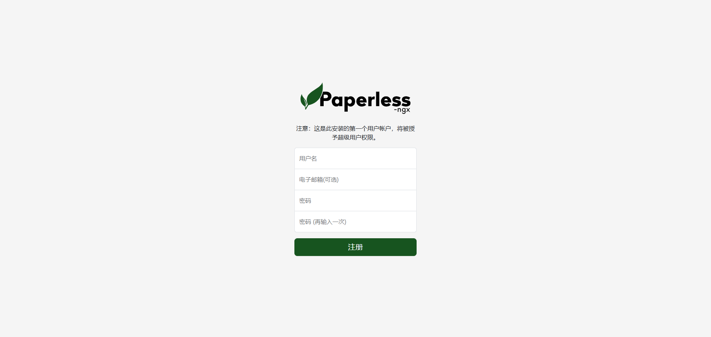
4. 登录后首页与概览：
   - 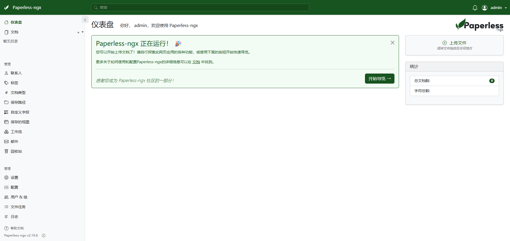

提示：编排文件会自动创建 `./consume`（导入）与 `./export`（导出）目录，并挂载至容器，数据卷包括 `data` 与 `media`。如需拉取最新镜像，可在启动前执行 `docker compose -f docker-compose.mariadb-tika.yml pull`。

## 使用前配置

1. 模型配置（LLM/VLM）：
   - 进入设置页，添加一个大语言模型与一个视觉模型
   - 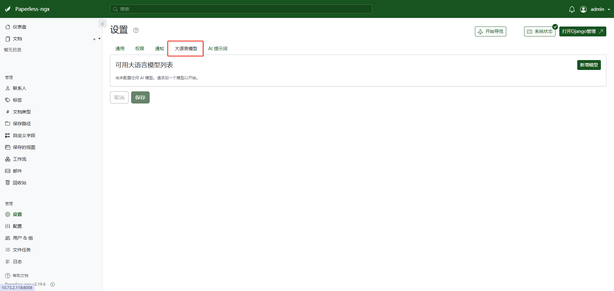
   - 示例（以火山引擎为例）：
     - 新增 LLM：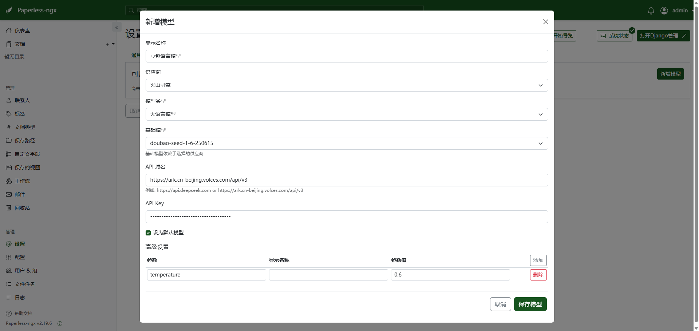
     - 新增 VLM：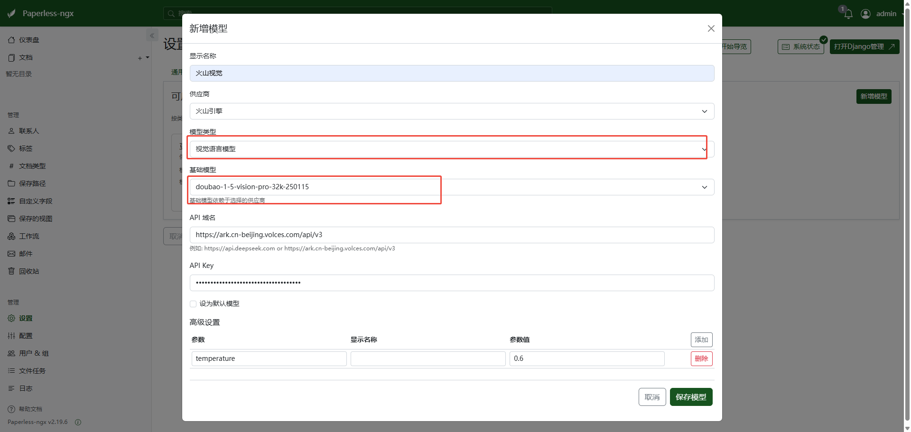
2. 提示词管理：
   - 系统已内置默认模板，可按业务场景调整
3. OCR 设置：
   - 语言设置：`chi_sim`
   - 启用「VLM 图像理解」，用于提升图片文字识别与内容理解
   - 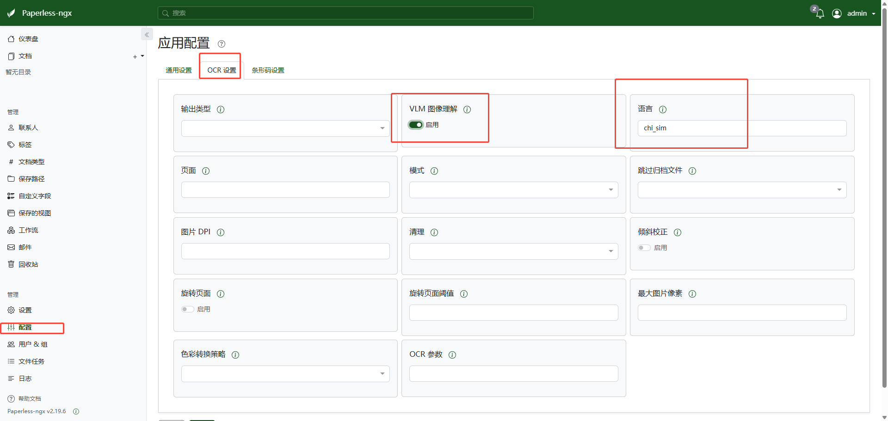
4. 保存配置后即可开始使用

## 典型用法

### 创建目录并进行层级组织：
- 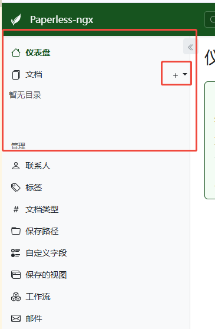
- 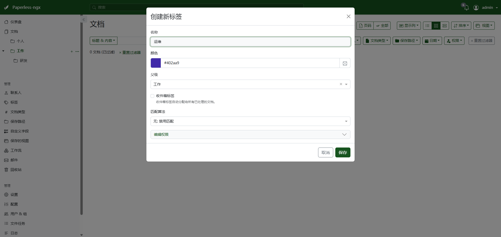
- 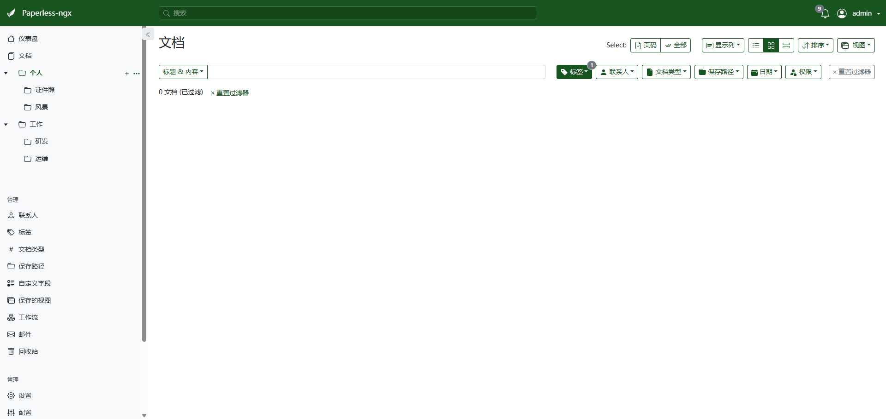
### 上传文件至指定目录节点：
- 批量上传后自动根据目录级别打标签
- 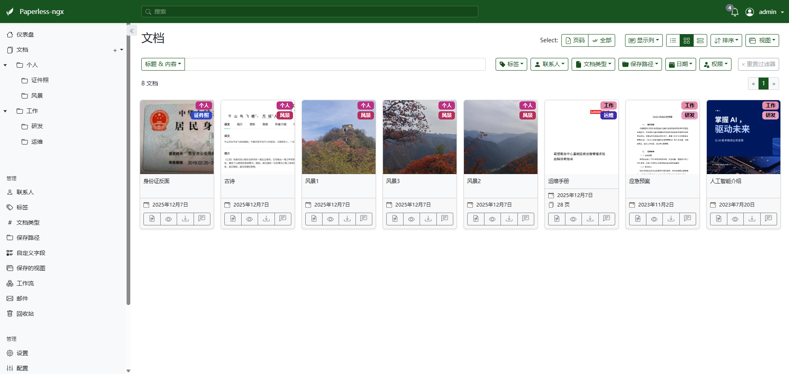

### AI 能力示例：
> 原来默认是OCR识别图片，但是手机拍的识别效果很差。 这里改为使用VLM，可以根据配置来决定。 VLM的好处是后续不管是文字识别、还是内容理解都可以。

- 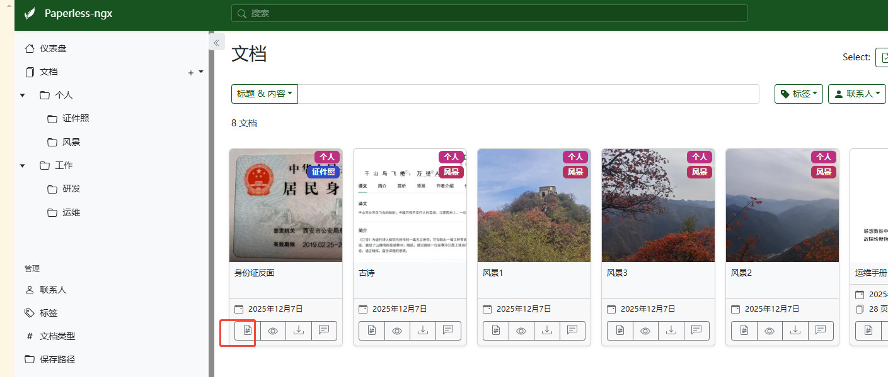
- 切换至内容视图：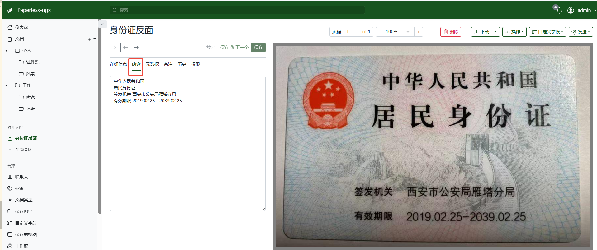
- 文档对话与内容解读：
- 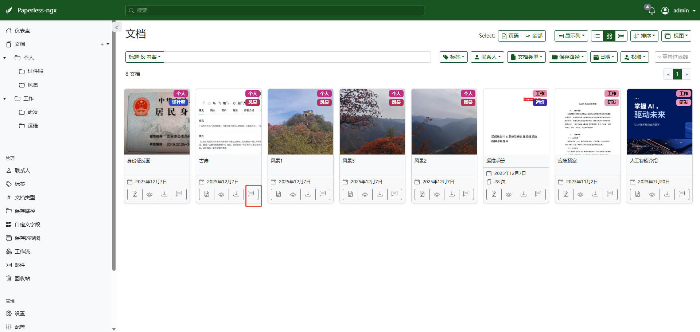
- 切换到文档对话：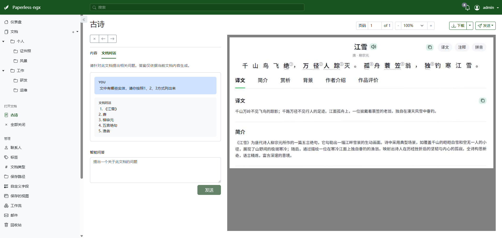

## 运维与架构要点

- 组件与端口：
  - `webserver`（应用服务，`8000` → 外部 `8008`）
  - `db`（MariaDB，默认凭据见编排文件）
  - `broker`（Redis，`6379`）
  - `tika`（Apache Tika，用于 Office 文档解析）
  - `gotenberg`（Office/PDF 转换与渲染）
- 数据卷与目录：
  - `data`、`media`（应用数据与媒体存储）
  - `./consume`（主机侧待导入目录）
  - `./export`（主机侧导出目录）
- 常用操作：
  - 查看日志：`docker compose -f docker-compose.mariadb-tika.yml logs -f webserver`
  - 更新镜像：`docker compose -f docker-compose.mariadb-tika.yml pull && docker compose -f docker-compose.mariadb-tika.yml up -d`

## 许可证与致谢

- 许可证：GNU GPLv3（详见仓库 `LICENSE`）
- 致谢：感谢 `paperless-ngx` 社区与所有贡献者，本项目在其之上进行增强与扩展

